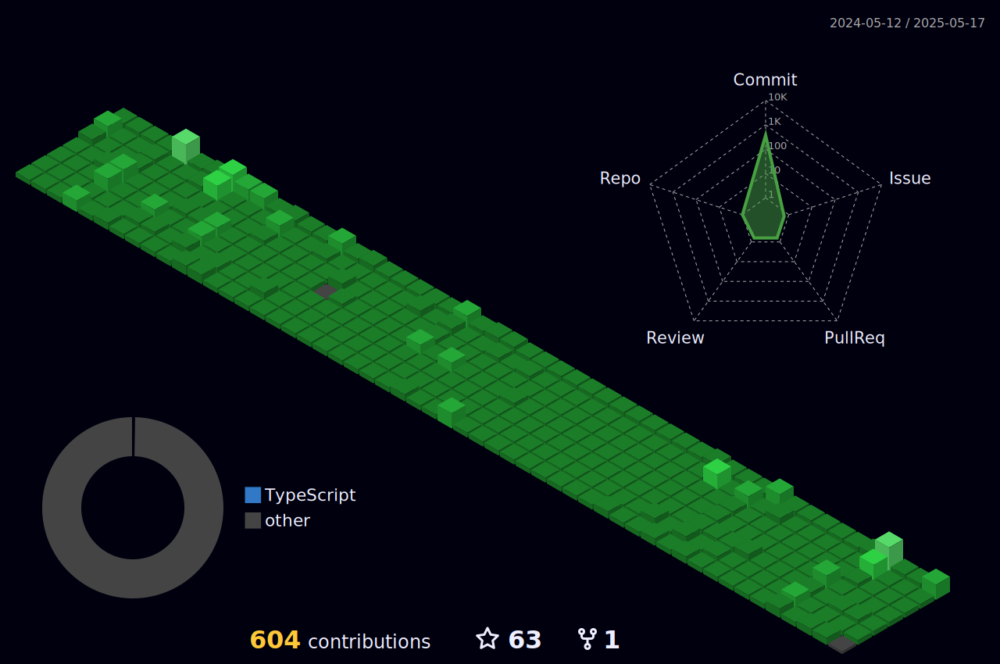

# :zap: Recent Activity

<!--START_SECTION:activity-->
1. 🎉 Merged PR [#79](https://github.com/melvnl/melvinliu.com/pull/79) in [melvnl/melvinliu.com](https://github.com/melvnl/melvinliu.com)
2. 💪 Opened PR [#79](https://github.com/melvnl/melvinliu.com/pull/79) in [melvnl/melvinliu.com](https://github.com/melvnl/melvinliu.com)
<!--END_SECTION:activity-->

# :newspaper_roll: Blog posts
<!-- BLOG-POST-LIST:START -->
- [steganography the art of concealing messages](https://melvinliu.com/blog/steganography-the-art-of-concealing-messages)
- [tabnabbing attack 101](https://melvinliu.com/blog/tabnabbing-attack-101)
- [simplified your mundane engineering workflow with aliases](https://melvinliu.com/blog/simplified-your-mundane-engineering-workflow-with-aliases)
- [the hidden danger of dictionary attack](https://melvinliu.com/blog/the-hidden-danger-of-dictionary-attack)
- [react query vs redux](https://melvinliu.com/blog/react-query-vs-redux)
<!-- BLOG-POST-LIST:END -->

# :sparkling_heart: Contributions

